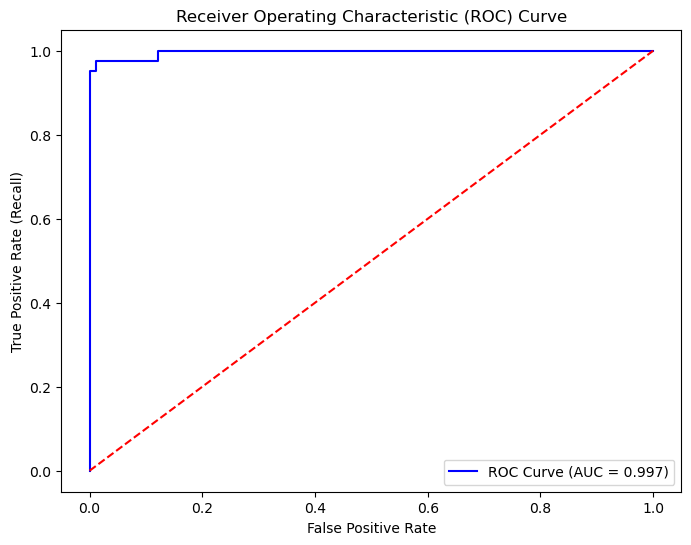

# Diabetes Classification Project

## Overview

This project focuses on training and assessing various machine learning models to determine whether a woman has diabetes based on a range of clinical characteristics. The analysis utilizes the [Pima Indians Diabetes Dataset](https://www.kaggle.com/datasets/uciml/pima-indians-diabetes-database).

The dataset was originally provided by the National Institute of Diabetes and Digestive and Kidney Diseases. It was selectively gathered from a larger database, focusing on female patients who are at least 21 years old and of Pima Indian descent.

The dataset includes multiple medical predictor variables along with a single target variable, "Outcome." The predictor variables cover aspects such as the number of pregnancies, BMI, insulin levels, and age, among others.

## File Structure

- `eda.ipynb`: Exploratory data analysis and data cleaning notebook.
- `experiment_1.ipynb`: Model training and evaluation with the elimination of missing values in the original dataset.
- `experiment_2.ipynb`: Model training and evaluation with the imputation of missing values in the original dataset.
- `dataset`: Directory containing the original dataset and its cleaned versions.
- `experiments_results`: Directory containing the results of the experiments.

## Project Workflow

1. **Data Analysis and Cleaning**: The dataset was analyzed to ensure all columns had the correct data types. Missing values, represented by zeros in certain metrics, were identified as incomplete records and were either imputed or removed. Outliers were also detected and eliminated.
2. **Feature Engineering**: Relationships and associations between variables were explored using correlation matrices, scatterplots, side-by-side boxplots, and overlapping histograms. Features with a strong association with the target variable were identified using t-tests and correlation analysis.
3. **Data Preprocessing**: As the dataset was imbalanced, preprocessing techniques such as SMOTE for oversampling were incorporated into the pipeline. Stratified splits were also ensured during data partitioning.
4. **Model Selection**: Logistic regression was used as the baseline model, with k-NN and Random Forest models trained to achieve better performance.
5. **Hyperparameter Tuning**: Grid search was employed to tune the models and identify the best estimator.
6. **Evaluation**: Models were evaluated using metrics such as accuracy, precision, recall, F1-score, confusion matrix, and ROC-AUC.

## Results and Conclusion

The models trained on the `diabetes_v2.csv` version, where missing values were imputed, demonstrated better overall performance, as shown in the table below. By imputing missing values, we were able to retain 665 out of 768 entries, eliminating 103 records deemed outliers. Retaining the majority of the data helped the models generalize better, resulting in improved performance metrics.

**Table: Experiment 2 Results (Imputed Missing Values)**

| Model Name     | Scaler Name       | Selected Features       | Accuracy | Precision | Recall  | F1-Score | ROC AUC  |
|----------------|-------------------|-------------------------|----------|-----------|---------|----------|----------|
| KNN            | RobustScaler      | Without BP and DPF       | 1.000000 | 1.000000  | 1.000000| 1.000000 | 1.000000 |
| KNN            | StandardScaler    | Without BP and DPF       | 1.000000 | 1.000000  | 1.000000| 1.000000 | 1.000000 |
| RandomForest   | RobustScaler      | Without BP and DPF       | 0.977444 | 0.933333  | 1.000000| 0.965517 | 1.000000 |
| RandomForest   | StandardScaler    | Without BP and DPF       | 0.977444 | 0.953488  | 0.976190| 0.964706 | 0.996860 |
| RandomForest   | StandardScaler    | All Features             | 0.969925 | 0.913043  | 1.000000| 0.954545 | 0.997645 |
| RandomForest   | RobustScaler      | All Features             | 0.969925 | 0.952381  | 0.952381| 0.952381 | 0.996075 |
| KNN            | RobustScaler      | All Features             | 0.812030 | 0.644068  | 0.904762| 0.752475 | 0.936028 |
| KNN            | StandardScaler    | All Features             | 0.804511 | 0.637931  | 0.880952| 0.740000 | 0.920591 |
| LogisticReg    | StandardScaler    | All Features             | 0.766917 | 0.600000  | 0.785714| 0.680412 | 0.859759 |
| LogisticReg    | RobustScaler      | Without BP and DPF       | 0.766917 | 0.600000  | 0.785714| 0.680412 | 0.872318 |
| LogisticReg    | StandardScaler    | Without BP and DPF       | 0.759398 | 0.586207  | 0.809524| 0.680000 | 0.869440 |
| LogisticReg    | RobustScaler      | All Features             | 0.759398 | 0.589286  | 0.785714| 0.673469 | 0.857666 |

### Key Takeaways

- **Best Performing Models**: The KNN models with RobustScaler and StandardScaler, excluding BP and DPF features, achieved perfect scores across all metrics, indicating potential overfitting. However, the Random Forest models also performed exceptionally well, with robust performance and high ROC-AUC values, suggesting they generalized better than other models.
- **Feature Selection Impact**: Excluding Blood Pressure (BP) and Diabetes Pedigree Function (DPF) slightly improved performance for both KNN and Random Forest models, highlighting the importance of feature selection in improving model accuracy.
- **Overfitting Concerns**: The perfect scores observed in some KNN models suggest overfitting, especially since these models performed too well on the training data, which may not reflect real-world scenarios. Further validation on unseen data is necessary to confirm these results.

The results suggest that imputing missing values and carefully selecting features can significantly enhance model performance, though caution is advised to avoid overfitting. Future work could focus on validating these models on an external dataset and exploring additional feature engineering techniques to further improve generalization.

### Random Forest Without Blood Pressure, Diabetes Pedigree Function and with Standard Scalar.

